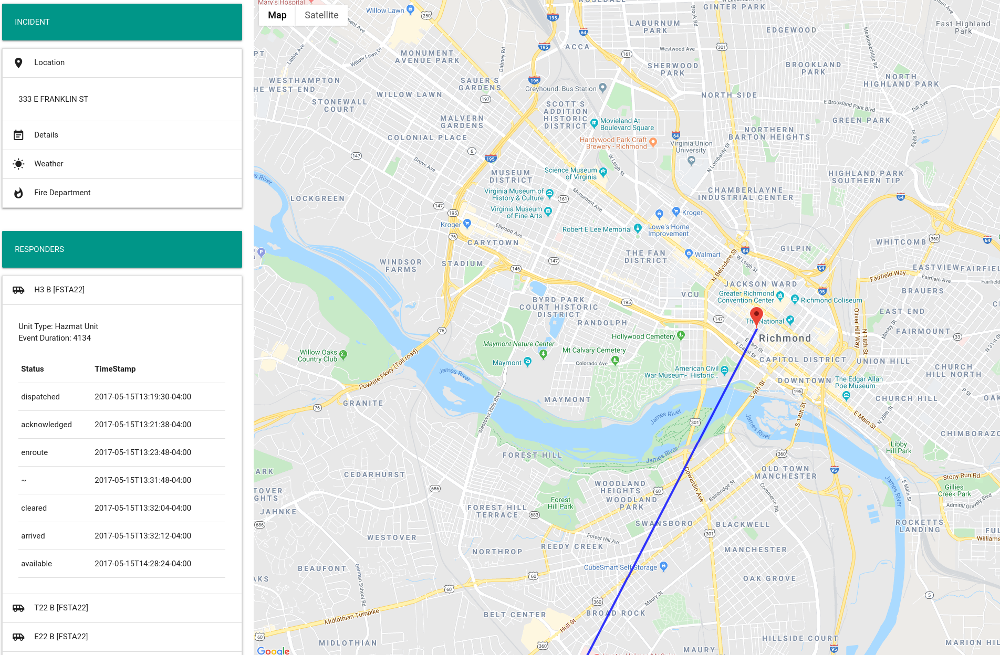

# Incident Reporter

## Running the application
Pre-requisites:
- Node.js
- NPM

To get started, perform the following commands:

```
npm install
npm run start
````

This will runs the app in development mode.
Open [http://localhost:3000](http://localhost:3000) to view it in the browser.

The page will reload if you make edits.

## Changing the data source
Change the following line in the `./src/App.js` file:

```
const incidentData = require('./data/F01705150050.json');
```


## Using the application

To use the application, select each of the collapsible items under "Incident" to get more information. To view the route of each responder and their status reported along the way, choose an item under "Responders".

